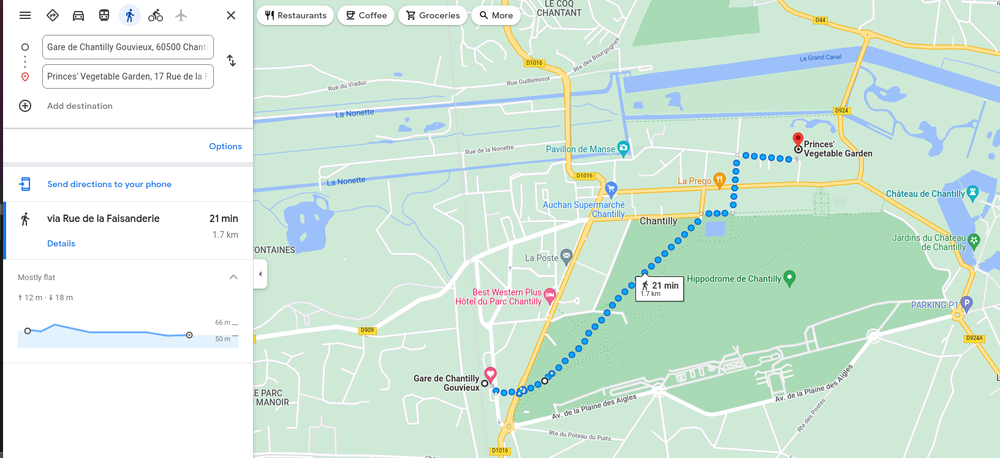
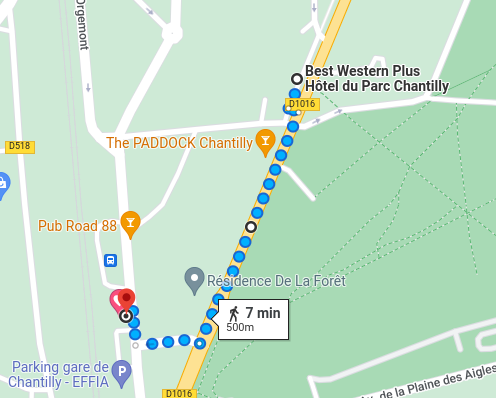

# Hi Tatiana & Ivan

Please do the following:

## Get a train to Chantilly

go to https://www.sncf-connect.com/en-en/

Destination: `Chantilly Gouvieux`

Departure:  `Gare du Nord (Paris)` or a station of your choice

 

Map:

https://www.google.com/maps/place/Gare+de+Chantilly+Gouvieux/

## Meet me at the station

Let me know on my mobile what time will you arrive.

Best times are in late morning, e.g. 10-11AM

## Go to the garden

destination:

https://goo.gl/maps/wH99sMrZzCcGBBqN8

Path:

[google maps](https://www.google.com/maps/dir/Gare+de+Chantilly+Gouvieux,+Chantilly/Princes'+Vegetable+Garden,+17+Rue+de+la+Faisanderie,+60500+Chantilly/@49.1914707,2.4634911,16z/data=!4m19!4m18!1m10!1m1!1s0x47e6486d98a16097:0x9768704619842cbd!2m2!1d2.459592!2d49.187611!3m4!1m2!1d2.4627525!2d49.1877121!3s0x47e6486d5afa4bad:0x4c8b181246817a12!1m5!1m1!1s0x47e648183b8817ed:0x11daa56d0fc3a2ac!2m2!1d2.4760555!2d49.1956623!3e2)

## Go to the restaurant via the library square

[google maps](https://www.google.com/maps/dir/Princes'+Vegetable+Garden,+17+Rue+de+la+Faisanderie,+60500+Chantilly/49.1902069,2.4630301/@49.1923781,2.463508,16.29z/data=!4m14!4m13!1m10!1m1!1s0x47e648183b8817ed:0x11daa56d0fc3a2ac!2m2!1d2.4760555!2d49.1956623!3m4!1m2!1d2.4672735!2d49.1933137!3s0x47e6481442644565:0x6f1a9da13c0eb9e1!1m0!3e2)

Menu: https://hotel-parc-chantilly.com/wp-content/uploads/2021/12/Menu-A4-dec-15.pdf 

## Back to the train station

# Take train back:

go to https://www.sncf-connect.com/en-en/

Destination: `Chantilly Gouvieux`

Departure:  `Gare du Nord (Paris)` or a station of your choice

## Taking a taxi

Unless you have way too much money, don't.

The road between Paris and Chantilly is very poor -- quite possibly this is by design! It takes much, much longer to come here by car than by train.

